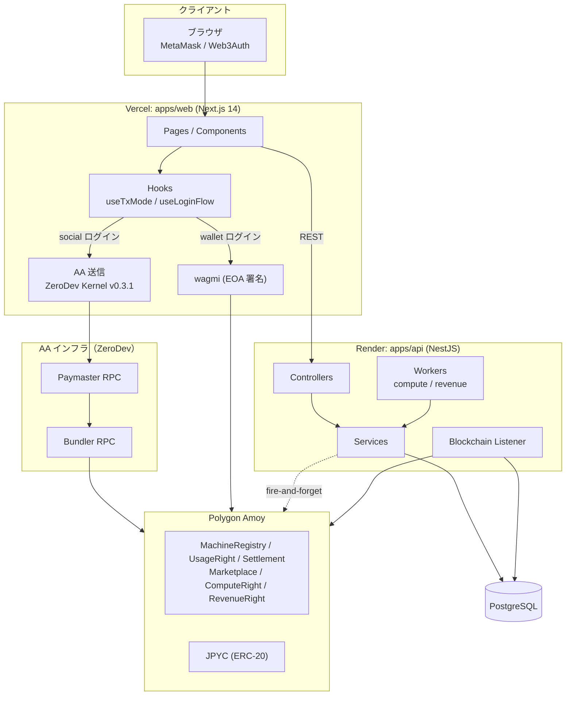
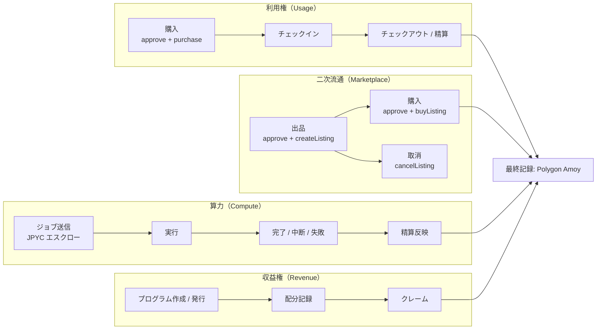

# NodeStay

NodeStay は、利用権マーケットとコンピュート市場を組み合わせた Web3 アプリケーションです。
フロントエンドは Next.js、バックエンドは NestJS、チェーンは Polygon Amoy（testnet）を使用しています。

> Built for JBA Blockchain Hackathon 2026

## 目次

1. [現在の実装状況](#現在の実装状況)
2. [技術アーキテクチャ（概要）](#技術アーキテクチャ概要)
3. [業務フロー（概要）](#業務フロー概要)
4. [技術スタック](#技術スタック)
5. [リポジトリ構成](#リポジトリ構成)
6. [セットアップ](#セットアップ)
7. [開発コマンド](#開発コマンド)
8. [デプロイ](#デプロイ)
9. [AA / Paymaster メモ](#aa--paymaster-メモ)
10. [参考ドキュメント](#参考ドキュメント)
11. [ライセンス](#ライセンス)

## 現在の実装状況

> 更新時点: 2026-03

- 利用権の購入・出品・二次購入・取消の主線が動作
- Web3Auth（ソーシャルログイン）からの AA 購入フローを全購入経路で統一実装
  - `useTxMode` フックが `loginMethod` を見て AA / wagmi を自動選択
  - ZeroDev Kernel Account v0.3.1 + ZeroDev Bundler + ZeroDev Paymaster
- ログインフローを有限状態機械（`LoginStep`）で管理し、状態残留バグを解消
- ユーザーストアのウォレットアドレスを3フィールドに分離
  - `connectedWalletAddress`（wagmi 注入）/ `socialWalletAddress`（Web3Auth）/ `walletAddress`（SIWE 認証済み）
- `Idempotency-Key` を使った API 冪等制御を実装
- Vercel（Web）+ Render（API/Worker）前提の構成

## 技術アーキテクチャ（概要）



> 詳細版は `docs/ARCHITECTURE.md` を参照してください。

## 業務フロー（概要）



## 技術スタック

- **Frontend**: Next.js 14, React 18, TypeScript, wagmi, viem, RainbowKit, Zustand
- **Backend**: NestJS, Prisma, PostgreSQL
- **Contracts**: Solidity, Hardhat, OpenZeppelin
- **AA**: Web3Auth + ZeroDev Kernel Account v0.3.1 + ZeroDev Bundler + ZeroDev Paymaster
- **Monorepo**: npm workspaces

## リポジトリ構成

```text
.
├─ apps/
│  ├─ web/     # Next.js
│  └─ api/     # NestJS
├─ packages/
│  ├─ contracts/
│  ├─ api-client/
│  └─ domain/
├─ docs/
├─ scripts/    # デバッグ・検証用スクリプト
└─ render.yaml
```

## 前提環境

- Node.js 20 以上
- npm 10 以上
- PostgreSQL 15 以上

## セットアップ

```bash
git clone <repository-url>
cd Node-Stay
npm install
```

### 1) API 環境変数

`apps/api/.env.example` を元に `apps/api/.env` を作成してください。

最低限必要な項目:

- `DATABASE_URL`
- `JWT_SECRET`
- `CORS_ORIGINS`
- `AMOY_RPC_URL`
- `MACHINE_REGISTRY_ADDRESS`
- `USAGE_RIGHT_ADDRESS`
- `SETTLEMENT_ADDRESS`
- `MARKETPLACE_ADDRESS`
- `COMPUTE_RIGHT_ADDRESS`
- `REVENUE_RIGHT_ADDRESS`
- `JPYC_TOKEN_ADDRESS`
- `OPERATOR_PRIVATE_KEY`（オンチェーン書き込みが必要な場合）

### 2) Web 環境変数

`apps/web/.env.local.example` を元に `apps/web/.env.local` を作成してください。

**基本設定（必須）:**

| 変数名 | 説明 |
|---|---|
| `NEXT_PUBLIC_API_BASE_URL` | NestJS API の URL |
| `NEXT_PUBLIC_CHAIN_ID` | `80002`（Polygon Amoy）|
| `NEXT_PUBLIC_CHAIN_NAME` | `Polygon Amoy` |
| `NEXT_PUBLIC_RPC_URL` | Amoy RPC URL |
| `NEXT_PUBLIC_CHAIN_EXPLORER_URL` | `https://amoy.polygonscan.com` |
| `NEXT_PUBLIC_JPYC_TOKEN_ADDRESS` | JPYC ERC-20 コントラクト |
| `NEXT_PUBLIC_SETTLEMENT_ADDRESS` | Settlement コントラクト |
| `NEXT_PUBLIC_MARKETPLACE_ADDRESS` | Marketplace コントラクト |
| `NEXT_PUBLIC_USAGE_RIGHT_ADDRESS` | UsageRight NFT コントラクト |

**Web3Auth（必須）:**

| 変数名 | 説明 |
|---|---|
| `NEXT_PUBLIC_WEB3AUTH_CLIENT_ID` | Web3Auth ダッシュボードで発行 |
| `NEXT_PUBLIC_WEB3AUTH_NETWORK` | `sapphire_devnet`（本番は `sapphire_mainnet`）|

**AA 購入フロー（必須）:**

AA（Account Abstraction）購入を動作させるには以下が **全て必要** です。
どれか一つでも欠けると「AA approve に失敗しました」エラーになります。

| 変数名 | 説明 |
|---|---|
| `NEXT_PUBLIC_BUNDLER_RPC_URL` | **ZeroDev の Bundler URL**（`https://rpc.zerodev.app/api/v3/<PROJECT_ID>/chain/80002`）|
| `NEXT_PUBLIC_PAYMASTER_RPC_URL` | **ZeroDev の Paymaster URL**（通常は Bundler URL と同一）|

> **重要**: Bundler / Paymaster は ZeroDev ダッシュボード（[dashboard.zerodev.app](https://dashboard.zerodev.app)）でプロジェクトを作成して取得してください。

> **Gas Policy**: ZeroDev ダッシュボードの **Gas Policies** で「全トランザクションをスポンサー」するポリシーを設定してください。
> 未設定の場合、UserOperation が `userOp did not match any gas sponsoring policies` で拒否されます。

任意設定:

| 変数名 | 説明 |
|---|---|
| `NEXT_PUBLIC_ENTRYPOINT_ADDRESS` | 未設定時は ERC-4337 v0.7 デフォルト値を使用 |
| `NEXT_PUBLIC_KERNEL_FACTORY_ADDRESS` | 未設定時は ZeroDev SDK デフォルトを使用 |

## 開発コマンド

ルートで実行:

```bash
npm run dev        # API + Web 同時起動
npm run build      # workspaces 全体 build
npm run typecheck  # workspaces 全体 typecheck
npm run test       # workspaces 全体 test
```

個別実行:

```bash
npm run dev -w @nodestay/api
npm run dev -w @nodestay/web
npm run dev:workers -w @nodestay/api
```

DB 補助:

```bash
npm run prisma:generate
npm run prisma:migrate
npm run prisma:studio
```

## デプロイ

### Vercel（Web）

- プロジェクトルート: リポジトリルート
- `NEXT_PUBLIC_*` 環境変数を全て設定
- **`NEXT_PUBLIC_BUNDLER_RPC_URL` の設定を忘れると AA 購入が全滅します**
- 環境変数追加後は必ず **Redeploy** してください

### Render（API / Worker）

- `render.yaml` をベースに構築
- API と Worker で同一のチェーン関連環境変数を設定
- `CORS_ORIGINS` に Vercel の本番 URL を追加

## AA / Paymaster メモ

- ソーシャルログイン時は `useTxMode` フックが自動で AA モードを選択
- ウォレットログイン時は `useTxMode` が wagmi モードを選択
- `loginMethod` の判定は全購入経路で `useTxMode` に集約（ページ側に分岐ロジックなし）
- Paymaster の API キーはフロント公開変数で扱うため、ZeroDev ダッシュボードで Origin 制限と利用上限を必ず設定してください

## 参考ドキュメント

- [docs/README.md](docs/README.md)
- [docs/ARCHITECTURE.md](docs/ARCHITECTURE.md)
- [docs/NodeStay_01_Product_Definition_and_Requirements.md](docs/NodeStay_01_Product_Definition_and_Requirements.md)
- [docs/NodeStay_02_Protocol_Architecture_and_System_Spec.md](docs/NodeStay_02_Protocol_Architecture_and_System_Spec.md)
- [docs/NodeStay_03_Economic_Model_and_Market_Design.md](docs/NodeStay_03_Economic_Model_and_Market_Design.md)
- [docs/NodeStay_04_Tokenization_Standard_Polygon_Edition.md](docs/NodeStay_04_Tokenization_Standard_Polygon_Edition.md)
- [docs/NodeStay_05_Pitch_Narrative_MVP_GTM_and_QA.md](docs/NodeStay_05_Pitch_Narrative_MVP_GTM_and_QA.md)
- [docs/NodeStay_Database_Schema_and_PRD_v2.md](docs/NodeStay_Database_Schema_and_PRD_v2.md)
- [docs/NodeStay_PRD_v3_FullSpec.md](docs/NodeStay_PRD_v3_FullSpec.md)
- [docs/NodeStay_Solidity_Interface_Draft.md](docs/NodeStay_Solidity_Interface_Draft.md)
- [docs/NodeStay_Whitepaper_Outline.md](docs/NodeStay_Whitepaper_Outline.md)

## ライセンス

本プロジェクトの権利は作成者個人に帰属します（All Rights Reserved）。
