# NodeStay アーキテクチャ詳細

> 最終更新：2026-03-08

---

## 目次

1. [技術アーキテクチャ](#1-技術アーキテクチャ)
   - 1-1. システム全体構成
   - 1-2. フロントエンド内部構造
   - 1-3. バックエンド内部構造
   - 1-4. データフロー（読み取り）
   - 1-5. データフロー（書き込み）
   - 1-6. 区块链イベント同期
2. [業務ロジックアーキテクチャ](#2-業務ロジックアーキテクチャ)
   - 2-1. 利用権市場（座席）フロー
   - 2-2. 二次流通市場（マーケットプレイス）フロー
   - 2-3. 算力市場（コンピュート）フロー
   - 2-4. 収益権市場（Revenue Right）フロー
   - 2-5. ステート遷移図（利用権）
   - 2-6. ステート遷移図（セッション）
   - 2-7. ステート遷移図（コンピュートジョブ）

---

## 1. 技術アーキテクチャ

### 1-1. システム全体構成

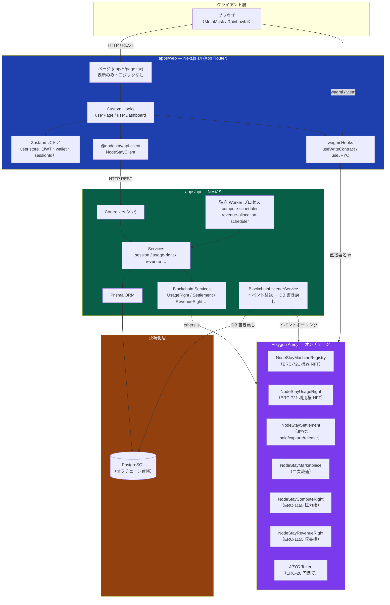

---

### 1-2. フロントエンド内部構造

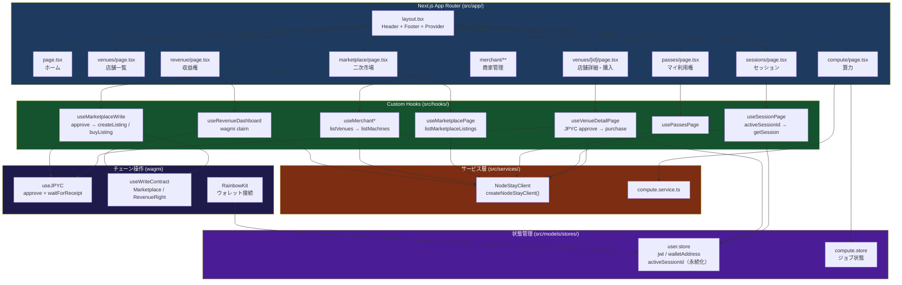

---

### 1-3. バックエンド内部構造

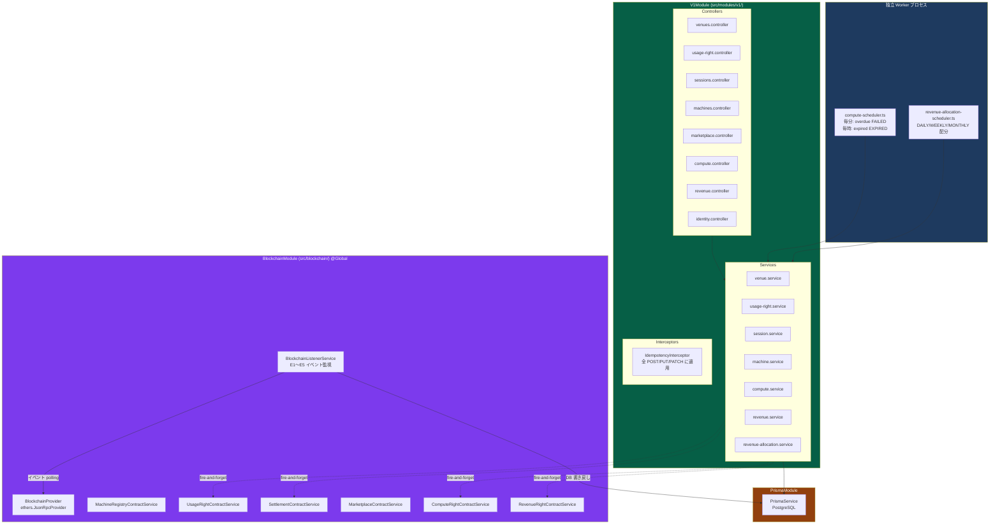

---

### 1-4. データフロー（読み取り）

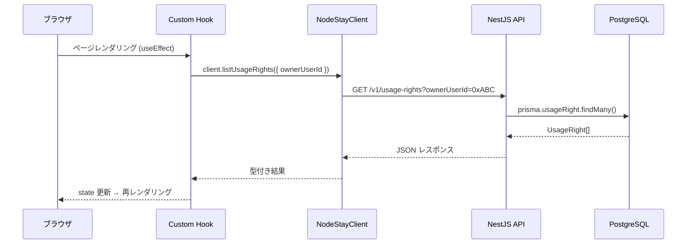

---

### 1-5. データフロー（書き込み：購入フロー）

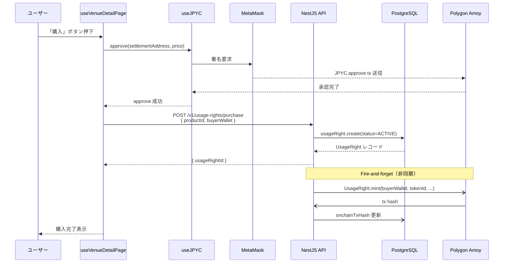

---

### 1-6. ブロックチェーンイベント同期

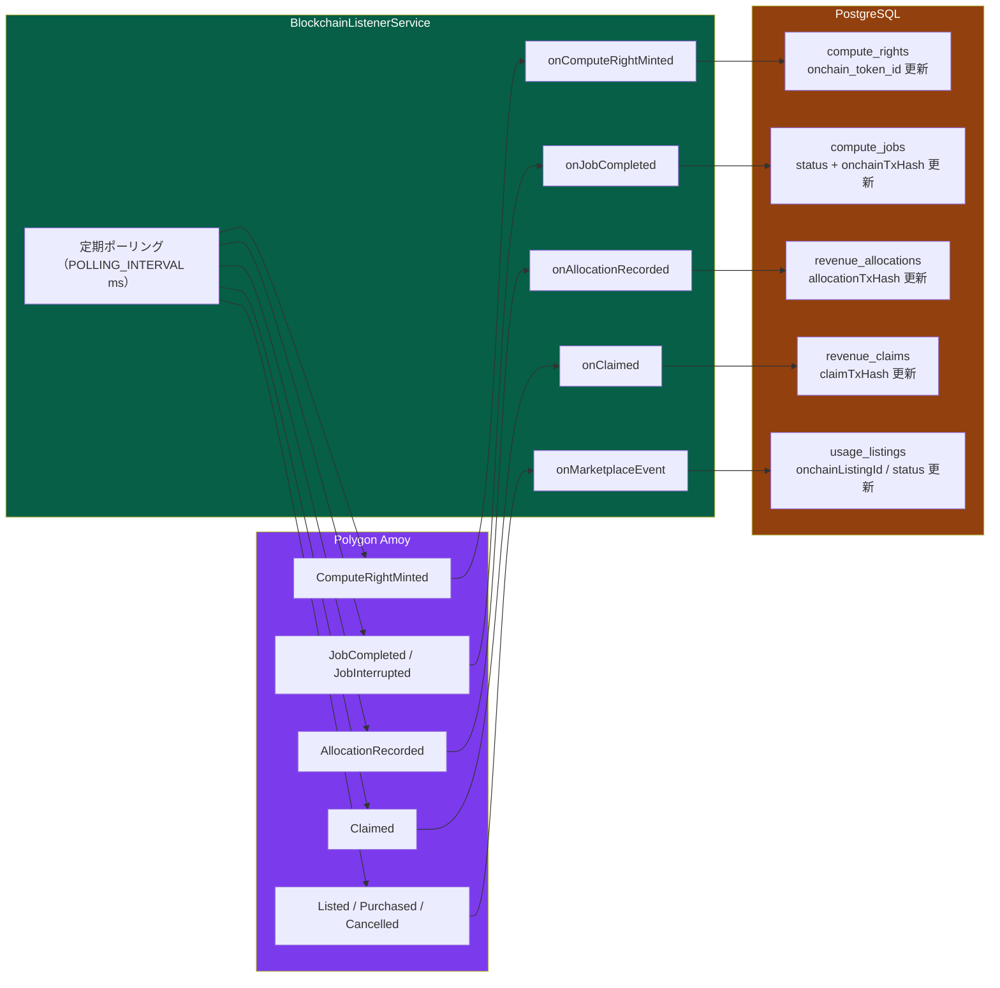

---

## 2. 業務ロジックアーキテクチャ

### 2-1. 利用権市場（座席）フロー

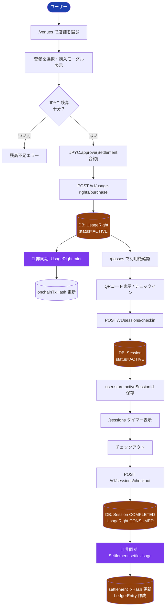

---

### 2-2. 二次流通市場（マーケットプレイス）フロー

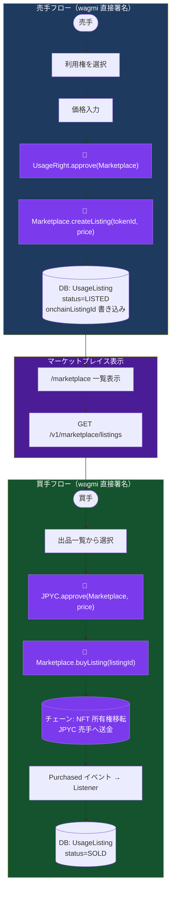

---

### 2-3. 算力市場（コンピュート）フロー

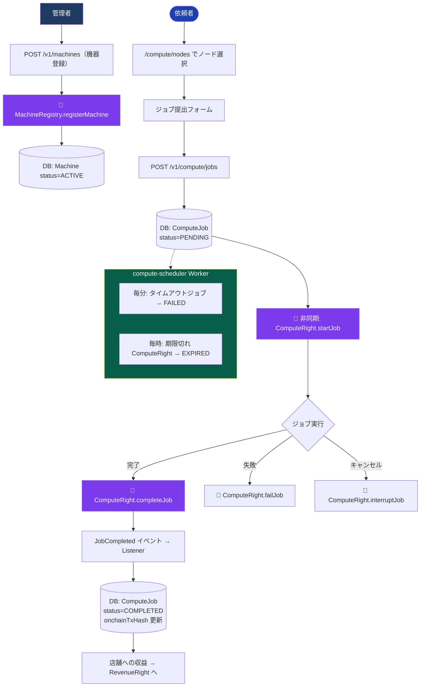

---

### 2-4. 収益権市場（Revenue Right）フロー

```mermaid
flowchart TD
    subgraph Issue["発行フェーズ（商家 + 管理者）"]
        M([商家]) --> P1["POST /v1/revenue/programs（草稿作成）"]
        P1 --> P2[("DB: RevenueProgram\nstatus=DRAFT")]
        P2 --> P3["POST .../approve（承認）"]
        P3 --> P4[("DB: status=APPROVED")]
        P4 --> P5["POST .../issue（チェーン発行）"]
        P5 --> P6["🔗 RevenueRight.createProgram(machineId, totalSupply, ...)"]
        P6 --> P7[("DB: status=ACTIVE\nonchainTxHash 更新")]
    end

    subgraph Distribute["分配フェーズ（Worker）"]
        W([revenue-allocation Worker]) --> D1["runBatch({ programId })"]
        D1 --> D2{"周期判定\nDAILY/WEEKLY/MONTHLY"}
        D2 --> D3["売上集計（sessions + compute_jobs）"]
        D3 --> D4["按分計算（保有トークン比率）"]
        D4 --> D5["🔗 RevenueRight.recordAllocation"]
        D5 --> D6[("DB: RevenueAllocation\nallocationTxHash 更新")]
    end

    subgraph Claim["受取フェーズ（投資家 / wagmi 直接署名）"]
        I([投資家]) --> C1["/revenue ダッシュボード"]
        C1 --> C2["配当一覧・未受取表示"]
        C2 --> C3["「受け取る」ボタン押下"]
        C3 --> C4["🔗 RevenueRight.claim(programId, allocationId)"]
        C4 --> C5["Claimed イベント → Listener"]
        C5 --> C6[("DB: RevenueClaim\nclaimTxHash 更新")]
        C6 --> C7["UI 再同期 (loadDashboard)"]
    end

    P7 --> W
    D6 --> I

    style Issue fill:#1e3a5f,color:#fff
    style Distribute fill:#065f46,color:#fff
    style Claim fill:#14532d,color:#fff
    style P6 fill:#7c3aed,color:#fff
    style D5 fill:#7c3aed,color:#fff
    style C4 fill:#7c3aed,color:#fff
```

---

### 2-5. ステート遷移図（利用権）

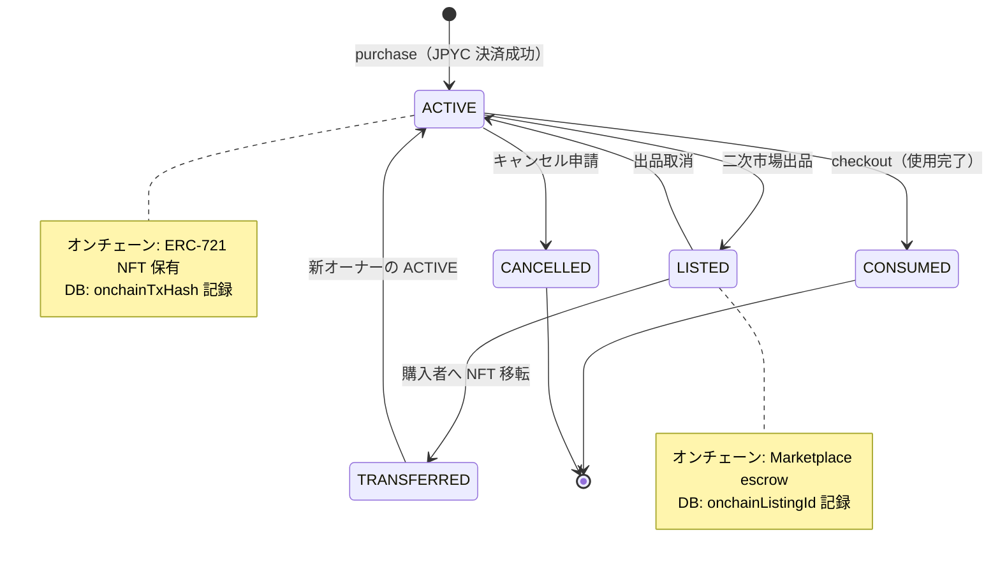

---

### 2-6. ステート遷移図（セッション）

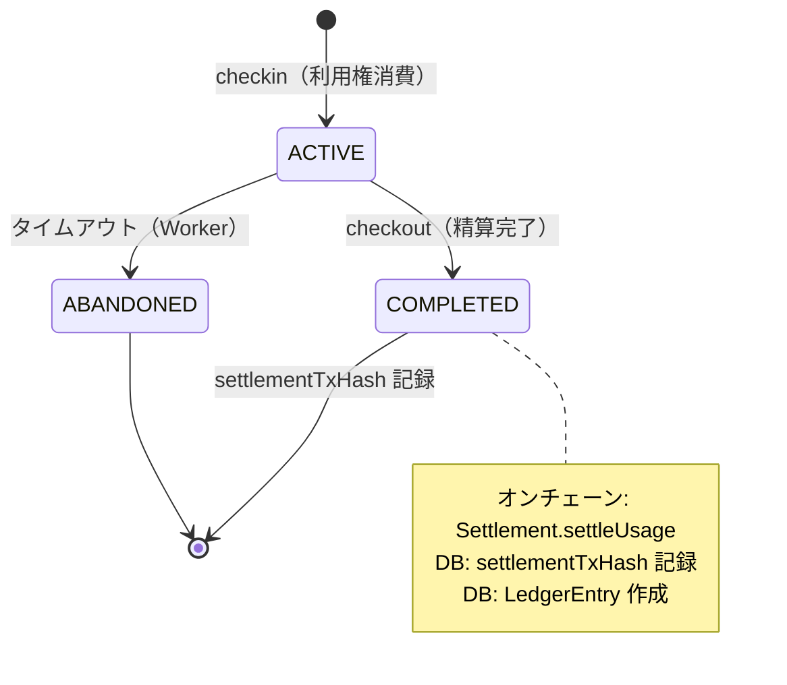

---

### 2-7. ステート遷移図（コンピュートジョブ）

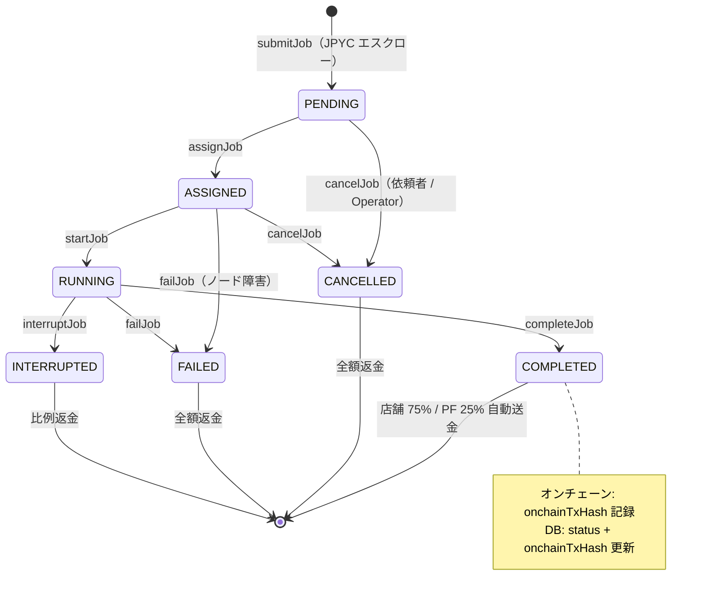

---

## 補足：データベース主要テーブル関連

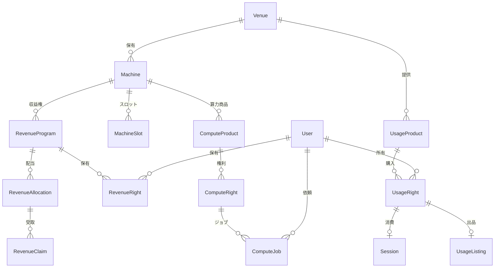
